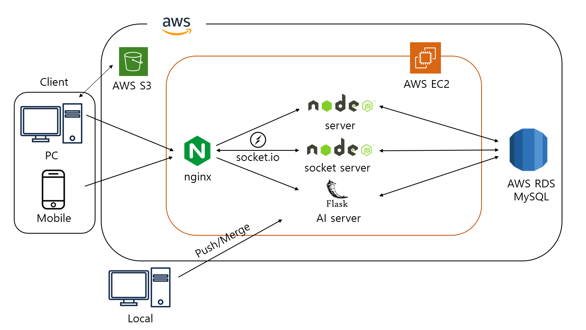
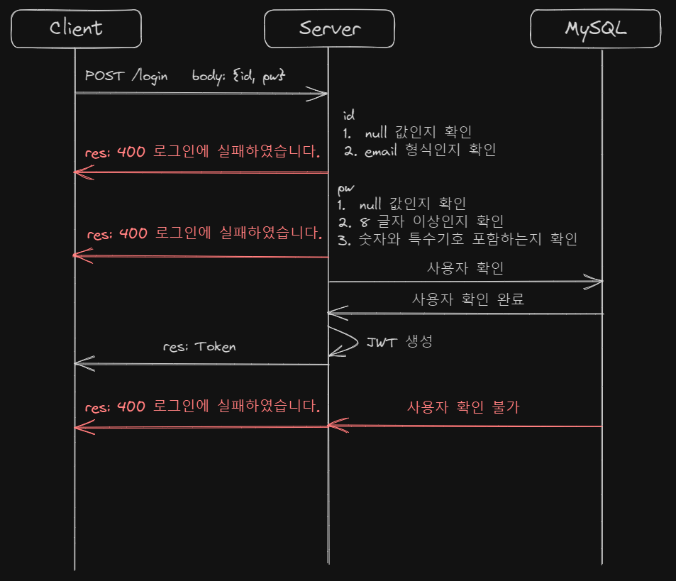
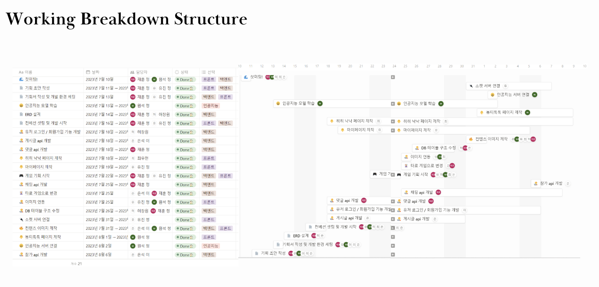
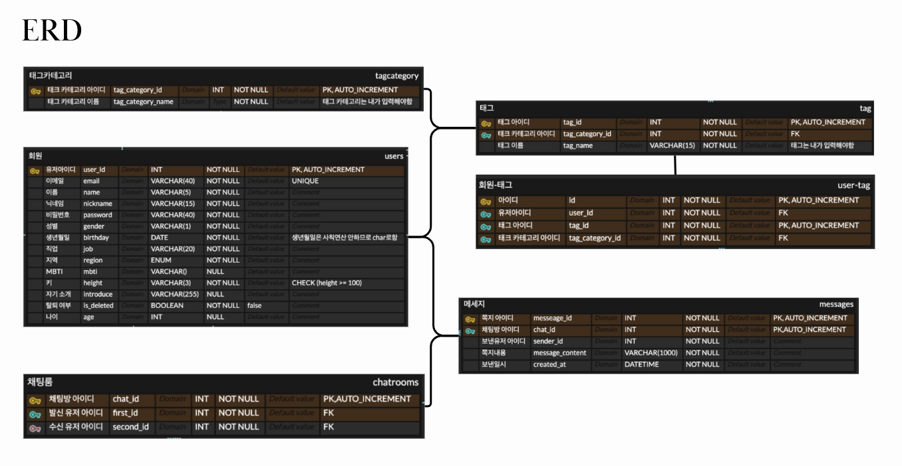
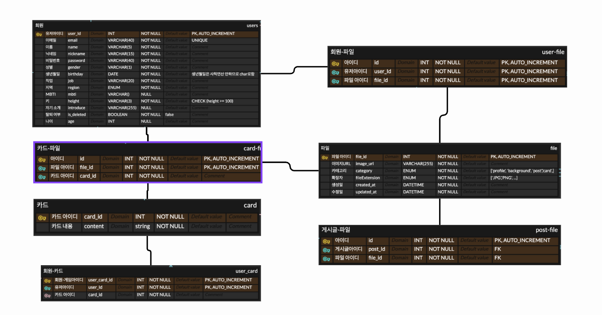
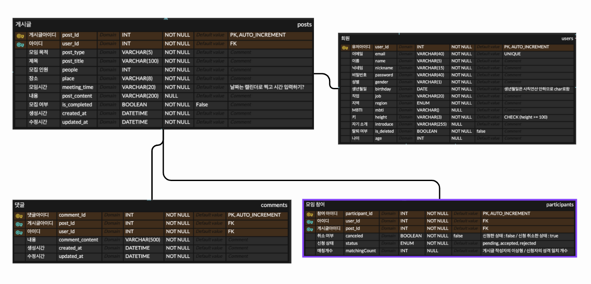

# KNOCK KNOCK

<br/>


<br/>

## 📄 개요

-   서비스명:KnockKnock
-   기획 기간: 2023.07.10 ~ 2023.07.21
-   개발 기간: 2023.07.10 ~ 2023.08.11
-   주제:같은 가치관을 공유하는, 진지한 연애를 원하는 사회 초년생과 안정적인 성인을 대상으로 하는 심층적인 만남의 기회를 제공하는 서비스
-   목표:“낙낙은 두 사람을 특별한 시간과 공간으로 이끄는 재미있는 경험을 제공한다.”
-   API 문서: [KnockKnock API](http://kdt-ai7-team03.elicecoding.com:5001/api-docs)
-   테스트 페이지: [KnockKnock 웹사이트](http://kdt-ai7-team03.elicecoding.com/)

### 프로젝트 기획

<br/>

-   **서비스 설명**
    1. **기획 의도 (문제 제시, 문제 해결)**
        - 직장인이 되면 대학생에 비해서 인간관계 폭이 좁아지는 현상이 발생한다.
          그로 인해 내가 원하는 이성을 만날 기회가 줄어든다. 소모임 등 다양한 커뮤니티에 참여로 시간을 할애하는 것이 부담스러운 사람들을 대상으로 만남의 기회를 제공하자!
        - 표면적으로는 코로나 기간 동안 사람 만나기 어려웠고, 요즘 세대의 특성으로 “서울대 소비트렌드 분석센터 트렌드코리아” 책에서 발표한 키워드 중에 '목적 관계'라는 것이 있다.
        - 예전의 기성세대들은 인간관계 확장을 대부분 우연, 인연에 기대서 했지만, 요즘 세대들은 내가 원하는 관계를 만들어 낸다. 따라서 연애에서도 취미와 목적이 뚜렷하고 비슷한 사람들끼리 만남을 이어나갈려 하는 목적 관계가 요즘 트렌드 중에 하나로 판단했다.
        - KnockKnock 에서는 유저들의 데이터를 기준으로 서로의 가치관과 성향 취미 등이 비슷한 유저들을 추천 해 주는 기능을 도입하여, 서비스 사용 유저가 자신의 이상형을 쉽게 발견 할 수 있도록 돕고, 실제 오프라인에서의 만남을 주도하여 만족스러운 연애 경험을 제공하고자 한다.
    2. **웹 서비스의 최종적인 메인 기능과 서브 기능 설명**
        1. 메인기능
           a. AI를 이용한 퍼스널 컬러 추천과 메이크업 기능
           b. 회원 데이터를 분석해서 서로 잘 맞는 유저를 추천 해주는 기능
           c. 게시글을 통한 모임 생성 기능
        2. 서브기능
           a. 소켓을 이용한 실시간 채팅 기능
           b. 타로 운세 게임을 통한 유저 추천 기능

<br/>

### 아키텍처



<br />

### 로그인 설계



<br />

## 🏁 테스트 방법

---

1.  해당 프로젝트를 clone 합니다.

    ```
    git clone 리포주소
    ```

2.  프로젝트 실행에 필요한 패키지를 설치합니다.

    ```
     cd knock_front
     yarn install
    ```

    ```
    cd knock_back
    yarn install
    ```

3.  프론트와 백엔드를 실행합니다.

        ```
        cd knock_front
        yarn dev
        ```

        ```
        cd knock_back
        yarn start
        ```

    <br/>

## 로드맵

[] javascript -> Typescript 적용
[] jenkins, Docker 등을 활용해 CI/CD 구축
[] 보안 강화
[] socket.io의 데이터베이스는 redis로 설계

## 기술 스택

### Front-End

<div>


</div>

<br />

### Back-End

<div>


</div>

<br />

### Server-Infra

<div>


</div>

### **인공지능**

<div>


</div>

<br />

-   **IA**


-   **WBS**



-   **ERD**







<br/>

## 🫶 팀원 소개

**정원석**

-   Front-End
-   wonsuk7950kr@gmail.com
-   Github: [@jeong1suk](https://github.com/jeong1suk)

**최우현**

-   Front-End
-   woohyun6549@gamil.com
-   Github: [@choiwoohyun123](https://github.com/choiwoohyun123)

**정유진**

-   Front-End
-   nanyoojinee@gmail.com
-   Github: [@nanyoojinee](https://github.com/nanyoojinee)

**정재훈**

-   Back-End
-   wjdwogns120523@gmail.com
-   Github: [@J-A-Y2](https://github.com/J-A-Y2)

**허창원**

-   Back-End
-   wonn22@gmail.com
-   Github: [@wonn23](https://github.com/wonn23)

**이은석**

-   Back-End
-   zhes4593@naver.com
-   Github:[@enxxi](https://github.com/enxxi)

<br/>
